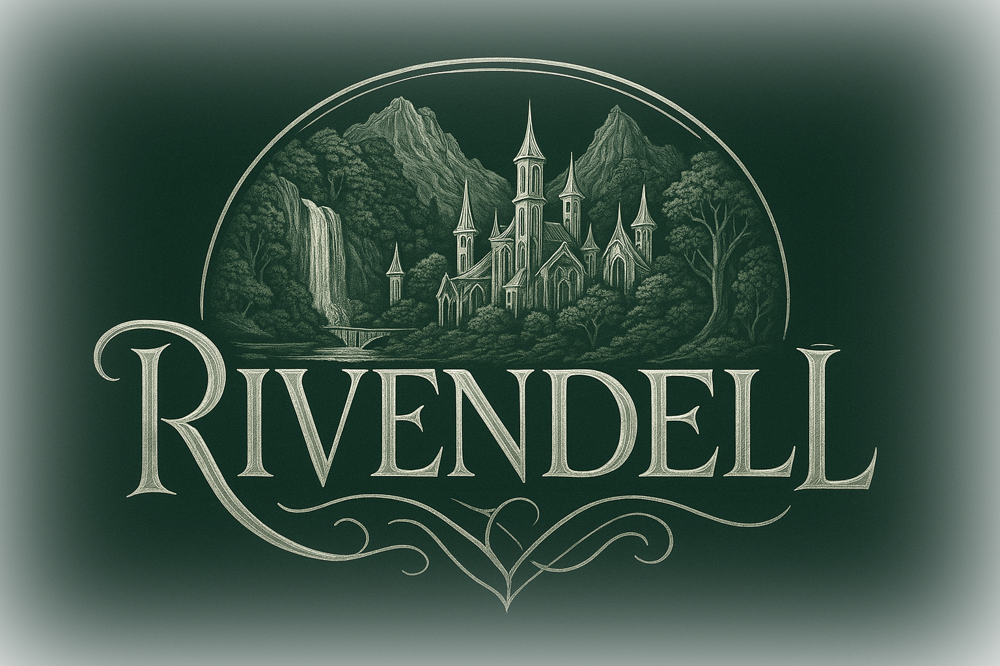

# Rivendell DF Acceleration Suite

<div align="center">
  

  **Digital Forensics Suite v2.0.0**
</div>
<div align="center">
  <i>The Last Homely House</i><br><br>

[](LICENSE)
[](https://www.python.org/downloads/)
[]()
</div>

---

## 🚀 Quick Start

### Installation

```bash
# 1. Clone repository
git clone https://github.com/cmdaltr/rivendell.git
cd rivendell

# 2. Install OrbStack (macOS - RECOMMENDED) or Docker Desktop
# OrbStack: 2-3x faster, uses less RAM, no networking bugs
brew install --cask orbstack

# For other platforms, use the installer:
# python3 scripts/install-rivendell.py

# 3. Configure forensic image paths
python3 scripts/image-paths.py

# 4. Start Rivendell in testing mode
./scripts/start-testing-mode.sh

# 5. Run your first test
cd tests
./scripts/run_single_test.sh win_brisk
```

**📖 [Complete Installation Guide →](INSTALL.md)** - Detailed setup instructions

**💡 Why OrbStack?** On macOS, OrbStack is 2-3x faster than Docker Desktop, uses ~4GB RAM instead of 8-12GB, and has no gVisor networking bugs that cause crashes with large forensic images. It's free for personal use.

### Access Rivendell

- **Web Interface:** http://localhost:5687
- **Backend API:** http://localhost:5688

### Quick Commands

```bash
# Manage forensic image paths
python3 scripts/image-paths.py

# Check job status
./scripts/status.sh

# Stop all jobs
./scripts/stop-jobs.sh

# View logs
docker-compose logs -f backend
```

### System Requirements

| Component | Minimum | Recommended |
|-----------|---------|-------------|
| **RAM** | 10GB | 16GB+ |
| **CPU** | 4 cores | 8+ cores |
| **Disk** | 10GB | 50GB+ |
| **OS** | macOS 12+, Ubuntu 20.04+, Windows 10+ | Latest versions |

**Supported Platforms:**
- macOS (Apple Silicon & Intel)
- Linux (Ubuntu, Debian, Fedora, RHEL, CentOS)
- Windows (with WSL2 recommended)

---

### Basic Usage

**Web Investigation Workflow:**

1. Access web interface at http://localhost:5687
2. Create a new investigation case
3. Upload evidence or configure remote acquisition
4. Monitor processing progress
5. View results, timelines, and ATT&CK mappings
6. Export reports and SIEM data

---

**CLI Investigation Workflow:**

_1. Acquire evidence from remote system_

<div align="left">
  <table><tr><td>
        
      </td><td>
        <code>python3 src/acquisition/python/gandalf.py Password 192.168.1.100 -u administrator -M -o /evidence/CASE-001</code>
      </td></tr><tr><td>
        
      </td><td>
        <code>sudo ./scripts/install_macos.sh</code>
      </td></tr><tr><td>
        
      </td><td>
        <code>.\scripts\install_windows_wsl.ps1</code>
  </td></tr></table>
</div>

_2. Process and analyze evidence_

`elrond -C -c CASE-001 -s /evidence/CASE-001 -m /evidence/CASE-001/memory.dmp -o /cases/CASE-001`

_3. Additional optional features_
  
&ensp;&ensp;&ensp;Map to MITRE ATT&CK<br>
&ensp;&ensp;&ensp;`python3 -m rivendell.mitre.mapper /cases/CASE-001`

&ensp;&ensp;&ensp;Index for AI analysis<br>
&ensp;&ensp;&ensp;`rivendell-ai index CASE-001 /cases/CASE-001`

&ensp;&ensp;&ensp;Query with natural language<br>
&ensp;&ensp;&ensp;`rivendell-ai query CASE-001 "What PowerShell commands were executed?"`

&ensp;&ensp;&ensp;Generate report<br>
&ensp;&ensp;&ensp;`rivendell-ai summary CASE-001 --format markdown --output report.md`

---

## 🌟 Key Features

### 🔍 Comprehensive Forensics Platform

- **Remote Acquisition** - Collect artifacts from remote Windows, Linux, and macOS systems
- **Automated Analysis** - Process evidence with 30+ integrated forensic tools
- **MITRE ATT&CK Integration** - Automatic technique mapping with comprehensive content-based detection and ATT&CK Navigator visualization
- **Cloud Forensics** - AWS, Azure, and GCP investigation support
- **AI-Powered Analysis** - Natural language queries of investigation data
- **Memory Forensics** - Volatility 3 integration for memory analysis
- **Timeline Generation** - Plaso/log2timeline for comprehensive timelines
- **SIEM Integration** - Direct export to Splunk and Elasticsearch

### 🎯 Core Components

```
            ┌─────────────────────────────────────────────────────────┐
            │                      Rivendell Suite                    │
            ├─────────────────────────────────────────────────────────┤
            │                                                         │
            │   ┌──────────────┐   ┌──────────────┐   ┌───────────┐   │
            │   │   Gandalf    │   │    Elrond    │   │    AI     │   │
            │   │ Acquisition  │ → │   Analysis   │ → │   Agent   │   │
            │   └──────────────┘   └──────────────┘   └───────────┘   │
            │          ↓                  ↓                 ↓         │
            │   ┌─────────────────────────────────────────────────┐   │
            │   │      MITRE ATT&CK • Cloud • SIEM • Reports      │   │
            │   └─────────────────────────────────────────────────┘   │
            │                                                         │
            └─────────────────────────────────────────────────────────┘
```

---

## 📋 Features Overview

### 🧙 Gandalf - Remote Acquisition

Collect forensic artifacts from local and remote systems.

**Features:**
- Multi-platform support (Windows, Linux, macOS)
- Remote acquisition via SSH and PowerShell
- Memory dump collection
- Encrypted evidence packaging
- SHA256 hashing and audit trails
- Comprehensive artifact collection


**Collected Artifacts:**
- System information
- Running processes
- Network connections
- Registry hives (Windows)
- Event logs (Windows)
- System logs (Linux/macOS)
- Browser artifacts
- User profiles
- Scheduled tasks
- Services
- Memory dumps

[Full Documentation →](docs/gandalf-README.md)

---

### 🧝‍♂️ Elrond - Automated Analysis

Process and analyze forensic evidence with integrated tools.

**Features:**
- Automated artifact parsing
- Timeline generation with Plaso
- Memory forensics with Volatility 3
- Registry analysis
- Event log parsing
- IOC detection
- Browser artifact extraction
- Multi-OS support (Windows, Linux, macOS)

**Integrated Tools:**
- Volatility 3 (memory analysis)
- Plaso/log2timeline (timeline generation)
- RegRipper (registry parsing)
- EvtxCmd (event log parsing)
- Bulk Extractor (IOC extraction)
- 25+ additional forensic utilities

[Full Documentation →](docs/elrond-README.md)

---

### Feature 1: MITRE ATT&CK Integration

Automatically map forensic findings to MITRE ATT&CK techniques with comprehensive content-based detection.

**Features:**
- Auto-updates from MITRE ATT&CK framework (v18.1)
- Content-based pattern matching for accurate technique detection
- 600+ ATT&CK techniques with full descriptions
- Multi-tactic technique support (techniques mapped to all relevant tactics)
- ATT&CK Navigator layer generation with automatic visualization
- Splunk dashboards for each technique with tactic badges
- Comprehensive JSON record scanning (all records, not sampled)
- Large file streaming support for files >10MB

**Usage:**
```bash
# Update MITRE data
python3 -m rivendell.mitre.updater

# Map artifacts to techniques
python3 -m rivendell.mitre.mapper /path/to/artifacts

# Generate Navigator layer
python3 -m rivendell.mitre.dashboard -o /output/dashboard.html
```

**Coverage:**
- 600+ ATT&CK techniques detected
- All 14 tactics covered
- Content-based pattern matching for accurate detection
- Evidence source mapping with full metadata

[Full Documentation →](docs/USER_GUIDE.md#feature-1-mitre-attack-integration)

---

### Feature 2: Coverage Analysis

Real-time MITRE ATT&CK coverage analysis during investigations.

**Features:**
- Standalone coverage analyzer
- Live detection as artifacts are processed
- Integration with Elrond analysis
- SIEM export (Splunk, Elasticsearch)
- Visual coverage dashboards

**Usage:**
```bash
# Analyze coverage
python3 -m rivendell.coverage.analyzer /cases/CASE-001

# Real-time monitoring
python3 -m rivendell.coverage.monitor --watch /cases

# Generate dashboard
python3 -m rivendell.coverage.dashboard -o dashboard.html
```

[Full Documentation →](docs/USER_GUIDE.md#feature-2-coverage-analysis)

---

### Feature 3: Enhanced Artifact Parsing

Extended support for Windows, macOS, and Linux artifacts.

**Features:**
- **Windows**: WMI persistence detection, scheduled tasks, services
- **macOS**: plists, launch agents/daemons, unified logs, FSEvents
- **Linux**: systemd services, cron jobs, bash history, auth logs

**Usage:**
```bash
# Parse Windows WMI
python3 -m rivendell.artifacts.windows.wmi /path/to/system

# Parse macOS artifacts
python3 -m rivendell.artifacts.macos.launch_agents /path/to/system

# Parse Linux artifacts
python3 -m rivendell.artifacts.linux.systemd /path/to/system
```

[Full Documentation →](docs/ARTIFACTS.md)

---

### Feature 4: Cloud Forensics

Investigate cloud infrastructure across AWS, Azure, and GCP.

**Features:**
- **AWS**: EC2 snapshots, CloudTrail analysis, S3 forensics
- **Azure**: VM disk snapshots, Activity Log analysis
- **GCP**: Compute Engine snapshots, Cloud Logging analysis
- Unified CLI across all providers
- MITRE ATT&CK mapping for cloud techniques

**Usage:**
```bash
# List AWS instances
python3 -m rivendell.cloud.cli aws list --credentials aws_creds.json

# Acquire Azure VM disk
python3 -m rivendell.cloud.cli azure acquire-disk \
  --instance-id myvm \
  --resource-group mygroup \
  --output ./output

# Analyze CloudTrail logs
python3 -m rivendell.cloud.cli aws analyze-logs \
  --log-file cloudtrail.json \
  --output ./analysis
```

**Detected Techniques:**
- T1078.004 - Cloud Accounts
- T1530 - Data from Cloud Storage
- T1580 - Cloud Infrastructure Discovery
- T1619 - Cloud Storage Object Discovery
- And 13+ more cloud-specific techniques

[Full Documentation →](docs/CLOUD.md)

---

### Feature 5: AI-Powered Analysis Agent

Query investigation data using natural language with local AI.

**Features:**
- Natural language queries of forensic data
- Investigation path suggestions
- Automated case summaries
- Web chat interface (port 5687)
- Privacy-focused local LLM (Ollama/LlamaCpp)
- Multi-artifact search (timeline, IOCs, processes, network, registry)

**Usage:**
```bash
# Index case data
rivendell-ai index CASE-001 /cases/CASE-001

# Query the case
rivendell-ai query CASE-001 "What PowerShell commands were executed?"

# Get investigation suggestions
rivendell-ai suggest CASE-001

# Generate case summary
rivendell-ai summary CASE-001 --format markdown --output summary.md

# Start web interface
python3 -m rivendell.ai.web_interface
# Access at http://localhost:5687/ai/chat/CASE-001
```

**Example Queries:**
- "What PowerShell commands were executed?"
- "Show network connections to external IPs"
- "What MITRE ATT&CK techniques were detected?"
- "Summarize the attack timeline"
- "What persistence mechanisms were found?"

[Full Documentation →](docs/AI_AGENT.md)

---

## 🛠️ Installation Requirements

**Core Requirements:**
- Python 3.8+
- Volatility 3
- Plaso/log2timeline
- 30+ forensic utilities

**Optional:**
- Ollama (for AI agent)
- Docker (for containerized deployment)
- Splunk/Elasticsearch (for SIEM integration)

**For complete installation guide, see:** [REQUIREMENTS.md](REQUIREMENTS.md)

---

## 📚 Documentation

### Getting Started
- **[Quick Start](QUICKSTART.md)** - Get started in 5 minutes
- **[Usage Guide](USAGE.md)** - Complete command reference for all features
- **[Workflows](WORKFLOWS.md)** - Common investigation workflows
- **[Requirements](REQUIREMENTS.md)** - Installation requirements and dependencies

### User Documentation
- **[User Guide](docs/USER_GUIDE.md)** - Comprehensive user guide
- **[Configuration](docs/CONFIG.md)** - Configuration options
- **[Support](docs/SUPPORT.md)** - Troubleshooting and help

### Component Documentation
- **[Artifacts](docs/ARTIFACTS.md)** - Supported artifact types and parsing
- **[Cloud Forensics](docs/CLOUD.md)** - AWS, Azure, and GCP investigations
- **[AI Agent](docs/AI_AGENT.md)** - Natural language analysis
- **[SIEM Integration](docs/SIEM.md)** - Splunk and Elasticsearch

### Technical Documentation
- **[Tools](docs/TOOLS.md)** - Integrated forensic tools
- **[Update Guide](docs/UPDATE_GUIDE.md)** - Update procedures
- **[Contributing](docs/CONTRIBUTION.md)** - Contribution guidelines

---

## 💡 Example Workflows

### Quick Examples

**Incident Response:**
```bash
# Quick triage → Analysis → MITRE mapping → AI query → SIEM export
python3 acquisition/python/gandalf.py Password 192.168.1.100 -u admin -o /evidence
elrond -C -c IR-2024-001 -s /evidence -o /cases/IR-2024-001
python3 -m rivendell.mitre.mapper /cases/IR-2024-001
rivendell-ai query IR-2024-001 "What lateral movement occurred?"
```

**Malware Analysis:**
```bash
# Acquire → Memory analysis → IOC extraction → Report
python3 acquisition/python/gandalf.py Password 192.168.1.50 -M -o /evidence
elrond -C -c MAL-001 -s /evidence -m /evidence/memory.dmp -o /output
rivendell-ai query MAL-001 "What IOCs were detected?"
rivendell-ai summary MAL-001 --format markdown --output report.md
```

**Cloud Investigation:**
```bash
# Acquire logs → Analyze → Query
python3 -m rivendell.cloud.cli aws acquire-logs --days 30 --output ./logs
python3 -m rivendell.cloud.cli aws analyze-logs --log-file ./logs/cloudtrail.json
rivendell-ai query CLOUD-001 "What suspicious AWS API calls were made?"
```

**For complete workflows, see:** [WORKFLOWS.md](WORKFLOWS.md)

---

## 🤝 Contributing

We welcome contributions! See [CONTRIBUTION.md](docs/CONTRIBUTION.md) for guidelines.

**Ways to Contribute:**
- Report bugs and request features
- Improve documentation
- Add support for new artifacts
- Develop integrations
- Share use cases and workflows

---

## 📄 License

This project is licensed under the MIT License - see the [LICENSE](LICENSE) file for details.

---

## 🙏 Acknowledgments

Rivendell integrates many excellent open-source forensic tools:

- **Volatility 3** - Memory forensics framework
- **Plaso/log2timeline** - Timeline generation
- **RegRipper** - Registry analysis
- **Bulk Extractor** - IOC extraction
- **MITRE ATT&CK** - Adversary tactics and techniques
- **Ollama** - Local LLM inference
- **LangChain** - AI orchestration

And 25+ additional tools. See [TOOLS.md](docs/TOOLS.md) for the complete list.

---

## 📚 Documentation

### Getting Started
- **[Installation Guide](INSTALL.md)** - Complete setup from git clone to first test
- **[Quick Start](tests/QUICK_START.md)** - Fast track for running tests
- **[Test Runner Guide](tests/docs/TEST_RUNNER_GUIDE.md)** - Comprehensive testing documentation

### Reference
- **[Docker Installation](scripts/DOCKER_INSTALL.md)** - Docker Desktop and OrbStack setup
- **[Gandalf Documentation](docs/gandalf-README.md)** - Remote acquisition guide
- **[Elrond Documentation](docs/elrond-README.md)** - Analysis engine guide
- **[Tools Reference](docs/TOOLS.md)** - All integrated forensic tools
- **[Support Guide](docs/SUPPORT.md)** - Troubleshooting and help

---

## 📞 Support

- **Documentation**: See [docs/](docs/)
- **Issues**: [GitHub Issues](https://github.com/cmdaltr/rivendell/issues)
- **Discussions**: [GitHub Discussions](https://github.com/cmdaltr/rivendell/discussions)

---

## 🗺️ Roadmap

**v2.2 (Planned):**
- Mobile device forensics (iOS, Android)
- Network forensics integration
- Automated reporting enhancements
- Additional SIEM integrations

**v2.3 (Future):**
- Collaborative investigation features
- Advanced ML-based anomaly detection
- Container forensics (Docker, Kubernetes)
- Threat intelligence integration

---

## 📊 Project Stats

- **Lines of Code**: 50,000+
- **Integrated Tools**: 30+
- **Supported Platforms**: Windows, Linux, macOS
- **Cloud Providers**: AWS, Azure, GCP
- **MITRE ATT&CK Techniques**: 600+
- **Artifact Types**: 50+

---

**Built with ❤️ for the DFIR community**

[⬆ Back to Top](#rivendell-dfir-suite)
